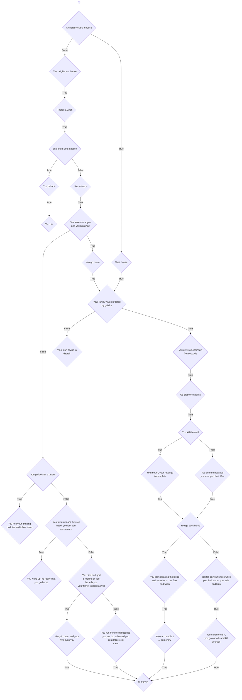

# **Dungeon Crawler**
## Introduction
**Gênero**: Fantasia ,RPG
- **Persspective**: Top-down
- **Plataform(s)**: PC, Nintendo Switch
- **Target Audience**: Jovens adultos, Adultos
- **Main influences**: Goblin Slayer, Grinmgar of fantasy and Ash
#### O objetivo, explorar dungeon e cidades para conseguir xp e items, estilo de batalha por turnos 
## Protagonista

## Item

## Historia
#### Após sair para ir buscar lenha, o protagonista retorna para casa e percebe que esta tudo muito calmo. Ao entrar em casa, ele é confrontado por uma visão aterradora:A família foi brutalmente assassinada. O que inicialmente começou como um dia normal tornou-se em um pesadelo, à medida que ele percebe que a morte de seus entes queridos.

## Links e Fontes
- https://goblin-slayer.fandom.com/wiki/Goblin_Slayer
- https://grimgar.fandom.com/wiki/Hai_to_Gensou_no_Grimgar_Wikia  
- https://hades.fandom.com/wiki/Hades_Wiki
- https://us.diablo3.blizzard.com/en-us/

